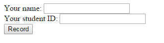
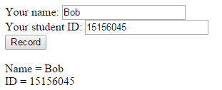
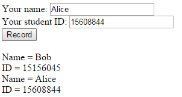

Your task for this lab is to develop a CGI program called DataRecord.cgi which
can record all the input data of students' information (name and ID).

Initial:

Record information of one student:

Record information of two students:

