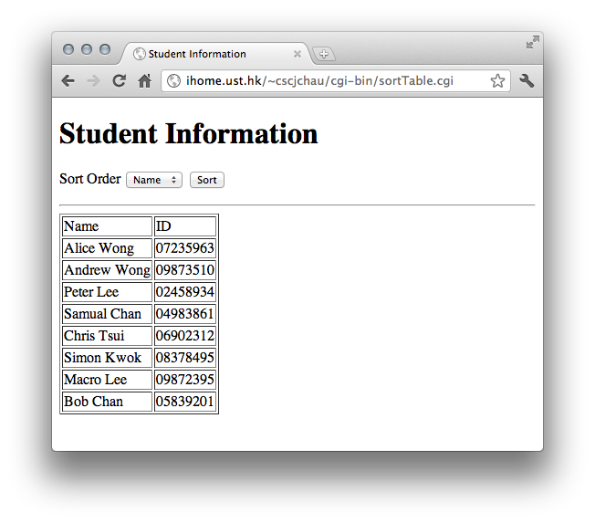
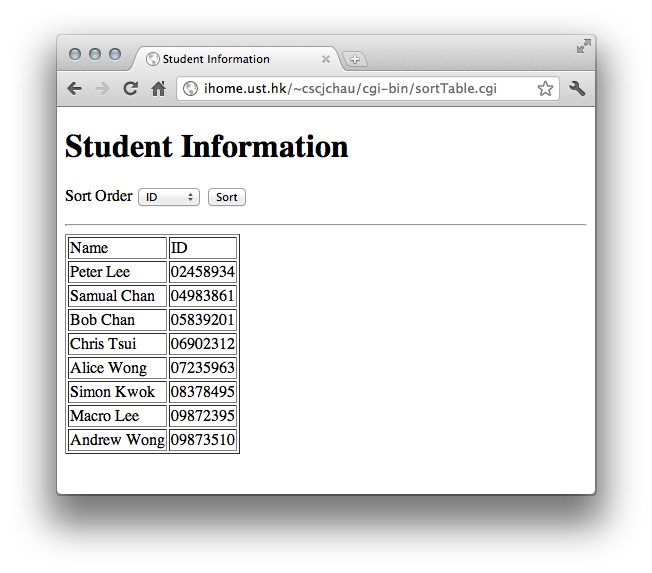

Your task for this lab is to develop a CGI program called sortTable.cgi which
display students' information (name and ID) stored in data.txt file and allow
user to view the information in different sorting order (sort by name or ID,
chosen by a popup menu and a submit button). You may put the text file in the
same directory (cgi-bin) with your CGI program. You may also assume all
students' names and ID are unique. Finally display the information using an HTML
table.The below are some screenshots of the finished CGI page.

Students displayed in the original order same as the text file:

Sorted by Name:

 

Sorted by ID:

 
